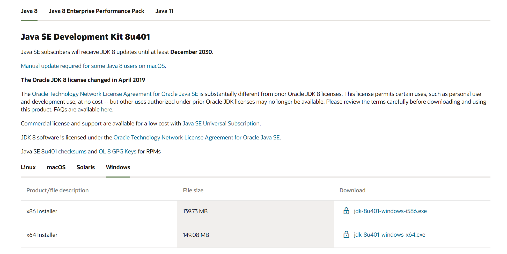

# 3/26

1. 本地跑js代码，获取camera，跑图像

* clone code，摄像头拍摄 html&js，但Open with Browser失败
* borrow code from B站，用node.js搭建端口，放置html失败
* 用tomcat
* 本机启动tomcat成功，但乱码，后续用和教程一样的版本

## 软件框架

1. html+js获取用户摄像头，拍摄照片，传输图片到服务器，
2. 服务器调用训练好的模型，识别，‘并返回判别表情
3. ~~选择动物，指定为判别表情~~

### 图像获取

找github

1. 

## 服务器搭建

1. Xshell远程登录
2. JDK，JSP，JAVA SE的区别?

[tomcat官网](https://tomcat.apache.org/whichversion.html)

[jdk与tomcat版本对应](http://t.csdnimg.cn/zh5ww)

[oracle官网](https://www.oracle.com/cn/java/technologies/downloads/#jdk21-windows)

* 为什么tomcat需要jdk?

> 因为tomcat是用java写的，所以运行需要JRE，就是JAVA运行时刻环境，所以必须通过安装JDK来得到这个运行环境，不装JDK装JRE也行，sun的网站上有下载。但是JRE只是运行时刻化境，不能编译JAVA源程序。

3. 服务器选择与环境配置(JDK1.8+Tomcat 9)

[在Linux安装配置Tomcat 并部署web应用 ( 三种方式 )](https://cloud.tencent.com/developer/article/1444767)

[install jdk](https://www.cnblogs.com/h--d/p/5071643.html)

[install tomcat](https://zhuanlan.zhihu.com/p/438459572)

[jdk环境变量设置](http://t.csdnimg.cn/ZZyAX)

[华为云部署tomcat](https://blog.csdn.net/yyxx99881199/article/details/105835196)
